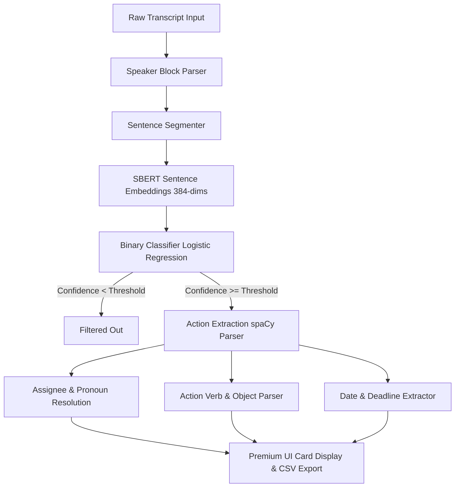

# Meeting Action Item Extractor 🎯

A semantic machine learning pipeline and Streamlit web interface that extracts actionable tasks, assignees, and deadlines from unstructured meeting transcripts.

---

## 🚀 Live Demo
Deploy your own live version in one click using Streamlit Community Cloud:
1. Fork this repository on GitHub.
2. Go to [share.streamlit.io](https://share.streamlit.io/).
3. Connect your GitHub account, select your fork, and click **Deploy**.

---

## 🏗️ Architecture & Pipeline
Below is the data flow showing how the system processes meeting transcripts:



---

## 📁 Repository Structure
* **`app.py`**: The Streamlit web application. Contains the UI layouts, interactive sliders, cached models, and card rendering logic.
* **`semantic_model.py`**: The Python model script containing SBERT batched encoding, labeling matrix logic, training script, and baseline evaluations.
* **`semantic_model.ipynb`**: Interactive Jupyter Notebook version of the pipeline for cell-by-cell execution.
* **`requirements.txt`**: List of dependencies for local environment setup and Streamlit Cloud.
* **`test_df.csv`**: The municipal council transcript training dataset.
* **`README.md`**: Project documentation.

---

## 🛠️ Key Features
- **Semantic Text Embeddings:** Uses Sentence Transformers (`all-MiniLM-L6-v2`) to capture context and meaning, letting the model recognize tasks across different industries (e.g. tech, medical, and municipal).
- **Pronoun & Speaker Resolution:** Automatically resolves pronouns (like `"I"` and `"We"`) to the speaker's name or team (e.g. *Charlie: "I'll send the email..."* resolves the assignee to **Charlie**).
- **Fast Training Loop:** Optimized using parallelized batch encoding (`batch_size=256`) and matrix cosine similarity lookups.
- **Real-Time Threshold Tuning:** Adjust prediction confidence dynamically (from `0.1` to `1.0`) in the web app sidebar to optimize precision vs recall instantly.
- **Data Export:** Export extracted action items to a CSV spreadsheet in one click.

---

## 📝 Writing Transcripts for Best Performance
Because the classifier is trained on municipal council meetings, it behaves best when sentences have a task-oriented or directive structure. 

| Instead of (Informal/Colloquial) | Use (Structured / Directives) |
| :--- | :--- |
| *“Emma, prepare the room now.”* | *“We recommend that Emma prepare the room immediately.”* |
| *“I'll review the reports tonight.”* | *“I recommend that we review the reports by tonight.”* |
| *“David should write the docs.”* | *“We request David to write the documentation.”* |

---

## 💻 Local Setup & Execution

### 1. Install Dependencies
```bash
pip install -r requirements.txt
```

### 2. Run the Web Interface
Start the Streamlit dashboard in your local browser:
```bash
streamlit run app.py --server.fileWatcherType none
```

### 3. Run the Python Script / Notebook
```bash
python semantic_model.py
```
Open **[semantic_model.ipynb](semantic_model.ipynb)** to inspect cells.

---

## 📊 Performance Analysis (CPU Trial)
Trained on a quick CPU-limited subset of 15 meetings, the semantic model significantly outperforms lexical matching baselines:

| Metric (Class 1) | TF-IDF Baseline (Full Dataset) | Sentence Transformers (15 Meetings) |
| :--- | :--- | :--- |
| **Precision** | 0.13 | **0.19** (+46%) |
| **Recall** | 0.68 | **0.73** (+7%) |
| **F1-Score** | 0.22 | **0.30** (+36%) |
| **Accuracy** | 0.89 | **0.91** (+2%) |

*Tip: Set `MAX_MEETINGS = None` in the notebook/script to train on the entire dataset when running on a GPU.*
